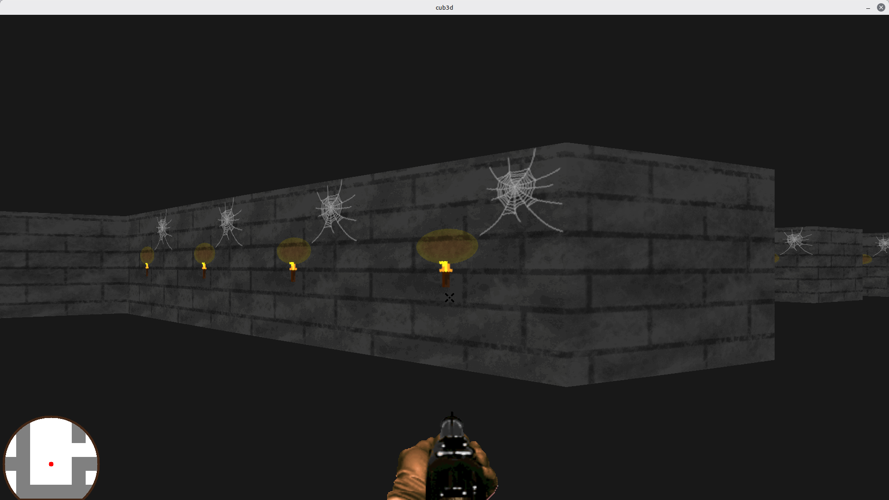

# 🎮 Cub3D - A Wolfenstein 3D inspired Raycaster


> **Cub3D** is a graphics project inspired by the 90s classic *Wolfenstein 3D*. It explores the **Raycasting** technique to render a 3D perspective from a 2D map.



## 🧠 What is Raycasting?

Raycasting is a rendering technique used to create a 3D perspective in a 2D map.
Instead of rendering 3D polygons (like modern engines), the engine casts "rays" from the player's position. When a ray hits a wall, the engine calculates the distance to draw a vertical strip of pixels. The height of the strip depends on the distance: the further away, the smaller the wall.

This project implements the **DDA (Digital Differential Analyzer)** algorithm for precise ray collision detection.

## ✨ Features

### Mandatory Part
* **Raycasting Engine:** Smooth 3D rendering using DDA.
* **Texture Mapping:** Different textures for North, South, East, and West walls.
* **Colors:** Floor and Ceiling colors defined in RGB.
* **Map Parsing:** Reads `.cub` files to configure the map and textures.

### 🌟 Bonus Part (Score: 125%)
* **Wall Collisions:** Prevents the player from walking through walls.
* **Minimap:** A 2D overlay showing the player's position in real-time.
* **Mouse Rotation:** Look around using the mouse.
* **Minimizing lag:** Optimized rendering loop.

## 🎮 Controls

| Key | Action |
| :--- | :--- |
| `W`, `A`, `S`, `D` | Move (Forward, Left, Back, Right) |
| `←`, `→` | Rotate Camera |
| `Mouse` | Rotate Camera (Bonus) |
| `Q` | Shoot Animation |
| `SPACE` | Open Doors |
| `ESC` | Quit Game |

## 🛠️ Installation & Usage

### 1. Requirements
* **Linux:** `gcc`, `make`, `xorg`, `libxext-dev`, `libbsd-dev`.
* **MacOS:** `make` (MLX uses OpenGL/AppKit).

### 2. Compilation
To compile the game (with bonuses):
```bash
make bonus
```

### 3. Run

```bash
./cub3D_bonus maps/bonus/<choose a map>
```

## 👥 Authors

This project was built by a duo:

* **COTONEA Melvin** - [Voir le profil GitHub](https://github.com/mcotonea42)
* **MILLIOT Marc** - [Voir le profil GitHub](https://github.com/NaYruk)